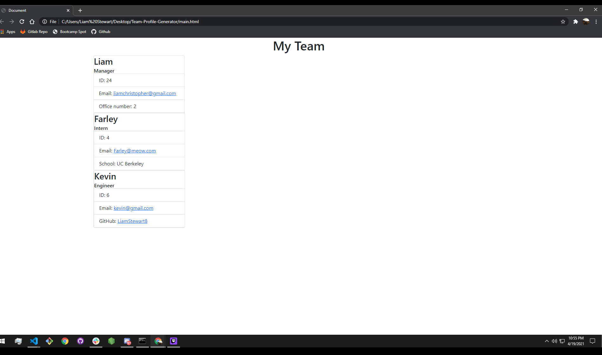

# Team-Profile-Generator

## Application=Picture



## Technologies Used
    - Javascript - Used to write the functions of the application
    - Inquirer - Used to gather the data from the user
    - Git - Version control system to track changes to source code
    - GitHub - Hosts repository that can be deployed to GitHub pages


## Summary
    Built a command line application to gather user data and dynamically create cards on the html file.


## Code Snippet
    Down below is a code snippet from my script, where I am dynamically generating the html cards.
``` let cardHtml = ''
cardHtml += `<div class="card" style="width: 18rem;">
<h3 class="card-title">${allData[0].managername}</h3>
<h6 class="card-subtitle">Manager</h6>
<ul class="list-group list-group-flush">
<li class="list-group-item">ID: ${allData[0].managerid}</li>
<li class="list-group-item">Email: <a href="mailto:${allData[0].manageremail}">${allData[0].manageremail}</a></li>
<li class="list-group-item">Office number: ${allData[0].managerofficenumber}</li>
</ul>`
```


## Author Links
[LinkedIn](https://www.linkedin.com/in/liamsctewart/)<br>
[Github](https://github.com/LiamStewart8)<br>
[Application Video](https://www.dropbox.com/s/bp61bussph680r5/Team-Profile-Generator.mp4?dl=0)